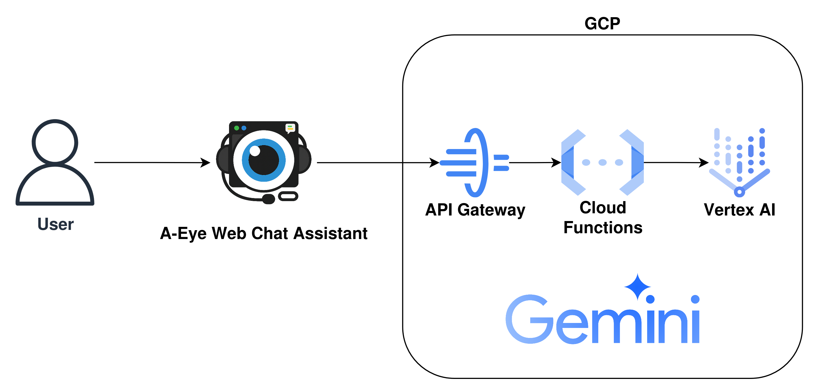

# A-Eye Web Chat Assistant Cloud Infra

This project provides infrastructure code and deployment guides for the [A-Eye Web Chat Assistant](https://github.com/vincentwun/A-Eye-Web-Chat-Assistant) Chrome extension on public cloud platforms.  
You can quickly deploy serverless backends, API Gateways, and related resources using mainstream clouds such as Google Cloud Platform (GCP) and Microsoft Azure.

[Read In Chinese](./README.zh.md)

---

## Features

- **GCP Infrastructure**: Deployment scripts for API Gateway, Cloud Functions, and Vertex AI integration.
- **Azure Infrastructure**: Deployment scripts for Azure API Management, Azure Functions, and Azure AI Foundry.
- **Secure API Proxy**: Securely proxies requests between the Chrome extension and cloud AI models.
- **Key Management**: Guidance for secure management of API keys and access credentials.

---

## Prerequisites

For the safest and latest installation, please refer to the official guides for CLI tools:

- [Azure CLI](https://learn.microsoft.com/zh-tw/cli/azure/install-azure-cli-linux?view=azure-cli-latest&pivots=apt)
- [Google Cloud CLI (gcloud)](https://cloud.google.com/sdk/docs/install?hl=zh-tw)
- [Terraform](https://developer.hashicorp.com/terraform/install#linux)

---

## GCP

### GCP Architecture


---

### GCP Terraform Deployment Guide

1. Enter the Terraform directory:
    ```bash
    cd gcp/terraform
    chmod +x ./*.sh
    ```

2. Login to Google Cloud:
    ```bash
    gcloud auth login --update-adc
    ```

3. Set up billing account:
    ```bash
    gcloud beta billing accounts list
    Billing_Account_ID=<Your Billing Account ID>
    ```

4. Set up Project ID:
    ```bash
    PROJECT_ID=a-eye-infra
    export TF_VAR_project_id=$PROJECT_ID
    ```

5. Run build.sh
    ```bash
    ./build.sh
    ```

6. Copy the output of `api_gateway_proxy_endpoint`and `api_key_string`

7. Config the copied info to chrome extension's `Setting` > `Cloud AI Settings` > `Vertex AI` > `API Gateway Endpoint` & `GCP API Key`

    Note: It may take 5 minutes for settings to take effect.

8. Delete GCP infra:
    ```bash
    terraform destroy -auto-approve
    ```

9. Delete GCP Project:
    ```bash
    gcloud projects delete $PROJECT_ID
    ```

---

## Azure

### Azure Architecture


---

### Azure Terraform Deployment Guide

1. Enter the Terraform directory:
    ```bash
    cd azure/terraform
    chmod +x ./*.sh
    ```

2. Login to Azure:
    ```bash
    az login --use-device-code
    ```

3. Set up Subscription :
    ```bash
    az account list --output table
    SUBSCRIPTION_ID=<YOUR_SUBSCRIPTION_ID_OR_NAME>
    az account set --subscription $SUBSCRIPTION_ID
    export ARM_SUBSCRIPTION_ID=$SUBSCRIPTION_ID
    ```

5. Run build.sh
    ```bash
    ./build.sh
    ```

6. Copy the output of `api_gateway_proxy_endpoint`and `api_key_string`

7. Config the copied info to chrome extension's `Setting` > `Cloud AI Settings` > `AI Foundry` > `API Management Endpoint` & `Azure API Key`

    Note: It may take 5 minutes for settings to take effect.

8. Delete Azure infra:
    ```bash
    terraform destroy -auto-approve
    ```

9. Delete Azure Project:
    ```bash

    ```

---

## License

This project is licensed under the MIT License. See [LICENSE](./LICENSE) for details.