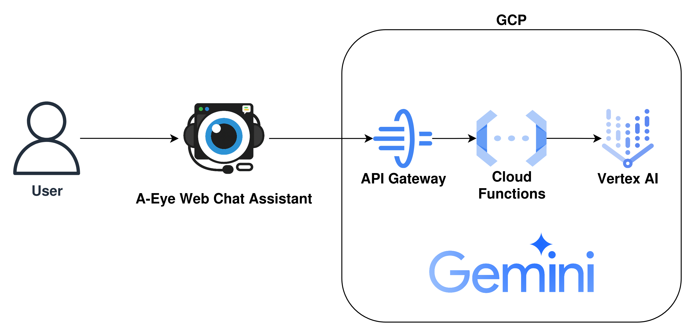
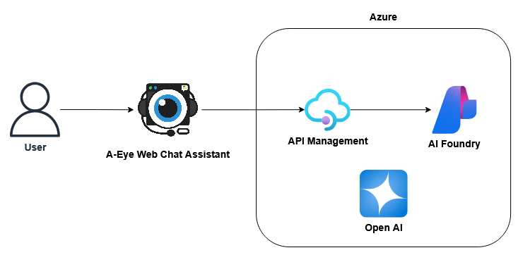

# A-Eye Cloud Infra

本專案提供 [A-Eye Web Chat Assistant](https://github.com/vincentwun/A-Eye-Web-Chat-Assistant) Chrome 擴充套件的公有雲端基礎建設程式碼及部署教學。  
你可用 Google Cloud Platform (GCP)、Microsoft Azure 等主流雲端，快速部署 Serverless 後端、API Gateway 及相關資源。

---

## 功能特色

- **GCP Infrastructure**：API Gateway、Cloud Functions、Vertex AI 整合部署腳本。
- **Azure Infrastructure**：即將推出。
- **安全 API Proxy**：安全代理 Chrome 擴充套件與雲端 AI 模型的請求。
- **金鑰管理**：API 金鑰及存取憑證安全管理指引。

---

## 架構圖

### GCP 架構


### Azure 架構


---

## 快速開始

### GCP CLI 部署教學

1. 進入 GCP CLI 目錄：
    ```bash
    cd gcp/gcp-cli
    chmod +x ./*.sh
    ```

2. 編輯並載入環境變數：
    - 修改 `1_setup_env.sh`，填入你的 `BILLING_ACCOUNT_ID`。
    - 載入環境變數：
      ```bash
      source ./1_setup_env.sh
      ```

3. 部署基礎建設並取得 Function URL：
    ```bash
    ./2_deploy_infra.sh
    ```
    - 複製輸出的 Function Invoke URL，填入 `api-config.yaml` 的 `address:` 欄位。

4. 建立 API Gateway 及 API Key：
    ```bash
    ./3_create_gateway_and_key.sh
    ```
    - 取得 API Gateway Endpoint 及 API Key，分別填入 Chrome 擴充套件設定。

---

### Terraform 部署教學

1. 進入 Terraform 目錄：
    ```bash
    cd gcp/terraform
    chmod +x ./*.sh
    ```

2. 編輯 `variables.tf` 及 `api-config.yaml.tftpl`，設定你的 GCP 資訊。

3. 建立資源：
    ```bash
    ./1_build.sh
    ```

4. 若要移除資源：
    ```bash
    ./2_destroy.sh
    ```

---

### Azure 部署教學

（即將推出，敬請期待）

---

## 安裝前置需求

請參考官方教學安裝 CLI 工具，確保取得最新版本及安全設定：

- [Azure CLI 官方安裝教學](https://learn.microsoft.com/zh-tw/cli/azure/install-azure-cli-linux?view=azure-cli-latest&pivots=apt)
- [gcloud CLI 官方安裝教學](https://cloud.google.com/sdk/docs/install?hl=zh-tw)
- [Terraform 官方安裝教學](https://developer.hashicorp.com/terraform/install#linux)

---

## 授權

本專案採用 MIT License，詳情請參閱 [LICENSE](./LICENSE)。